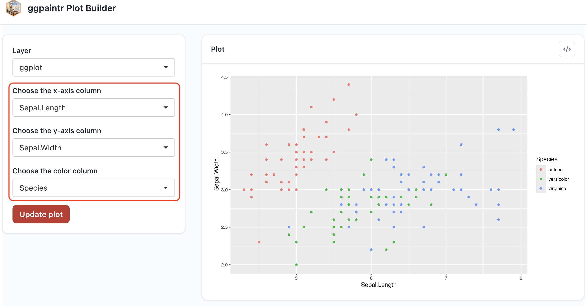
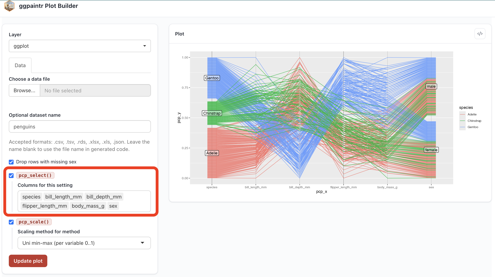
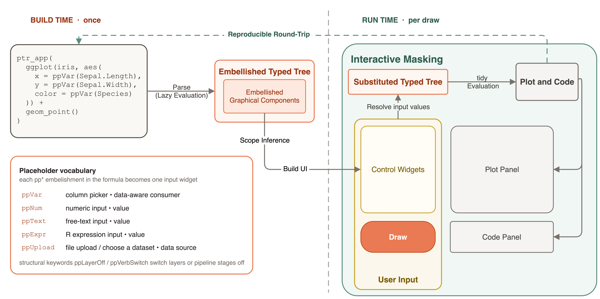
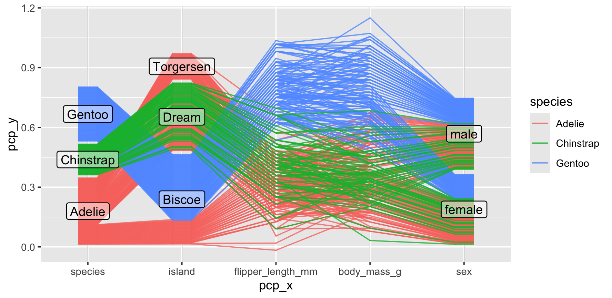

## The idea in one line {.smaller}

:::: {.columns .col-divider}
::: {.column width="35%"}
Ordinary R plotting code (`ggplot2`) for a scatterplot, with three values
**embellished** as `ppVar(...)`.

```r
library(ggpaintr)

ptr_app(
  ggplot(iris,
    aes(x = ppVar(Sepal.Length),
        y = ppVar(Sepal.Width),
        color = ppVar(Species))) +
    geom_point()
)
```
:::
::: {.column width="65%"}
The Shiny app that one expression becomes:

{height="330"}
:::
::::

. . .

Each embellished value becomes exactly one control — `ggpaintr` generates the
rest of the app.

## Outline

- **Motivation** — why turn parts of a graphic into controls, and why that's harder than it should be
- **Demo** — the iris-penguins app
- **Background** — Shiny, the grammar of graphics, lazy & tidy evaluation
- **Design** — placeholders, embellishment, **interactive masking**
- **Extensibility** — custom placeholders, embedding, sharing, your own render path
- **Reproducibility** — the code panel and saved states
- **Related tools**, **limitations & future work**, and more examples

## &nbsp; {.isu-section background-image="assets/campus.jpg" background-size="cover"}

[Part 1]{.eyebrow}

[Motivation]{.big}

[]{.rule}

[Why turn parts of a graphic into controls — and why is that harder than it should be?]{.sub}

## Motivation: two moments where a Shiny app is helpful

- **Shiny dashboard**
  - presenting a **finished** analysis in a Shiny app, with pre-defined and chosen controls exposed to users
  - structured layout, navigation, sharing
- **Exploration tool**
  - visualizing data with different combination of variables quickly

## Shiny dashboard

A published parallel-coordinate plot of the penguins
[@vanderplas2023penguins], built with `ggplot2` + `ggpcp`. Turn it into a
dashboard: pick the axes, rescale, recolor.

{height="360" fig-align="center"}

. . .

`shiny::runApp("demos/01-ggpcp-dashboard.R")`

## Explore data {.smaller}

The question: how does each pair of `iris` variables relate?

In plain `ggplot2`, we write one call, then edit it, again and again:

```r
library(ggplot2)

ggplot(iris, aes(x = Sepal.Length, y = Sepal.Width, color = Species)) +
  geom_point()

# now change x... and y... and color
ggplot(iris, aes(x = Petal.Length, y = Petal.Width, color = Species)) + 
  geom_point()

ggplot(iris, aes(x = Sepal.Length, y = Petal.Length, color = Species)) + 
  geom_point()
```

. . .

Re-typing the same call to change three slots is exactly where a widget should be used in an app.

. . .

`shiny::runApp("demos/02-iris-explore.R")`

<!-- ## &nbsp; {.isu-section background-image="assets/campus.jpg" background-size="cover"} -->

<!-- [Demo]{.eyebrow} -->

<!-- [Scenario 2]{.big} -->

<!-- []{.rule} -->

<!-- [Three dropdowns: X, Y, Color]{.sub} -->


## Shiny code behind the iris app {.smaller .scrollable}

:::: {.columns}
::: {.column width="55%"}
```r
ui <- fluidPage(
  titlePanel("Iris scatter"),
  sidebarLayout(
    sidebarPanel(
      selectInput("x", "X variable",
        choices = names(iris)[1:4], selected = "Sepal.Length"),
      selectInput("y", "Y variable",
        choices = names(iris)[1:4], selected = "Sepal.Width"),
      selectInput("color", "Color variable",
        choices = names(iris), selected = "Species")
    ),
    mainPanel(plotOutput("plot"))
  )
)

server <- function(input, output, session) {
  output$plot <- renderPlot({
    ggplot(iris, aes(x = .data[[input$x]],
                     y = .data[[input$y]],
                     color = .data[[input$color]])) +
      geom_point()
  })
}

shinyApp(ui, server)
```
:::
::: {.column width="45%"}
The obligations behind those 25 lines:

- every widget needs a **unique ID, label, choices, default**
- the dropdown returns a **string**, but `aes()` wants a **symbol**, so `.data[[input$x]]` is used
- the plot is declared both in `ui` and `server`, and IDs must match
- UI pieces placed for the right layout
:::
::::

::: {.fragment}
Adding more layers to the graphic requires more control widgets

- For example, add a title, facet, and smoothing method
- each new control multiplies all of this
:::

## Reproduce the same app with ggpaintr {.smaller}

The same app — one `ptr_app()` call:

:::: {.columns .col-divider}
::: {.column width="45%"}
```{.r code-line-numbers="1,3-5"}
ptr_app(
  ggplot(iris, aes(
    x = ppVar(Sepal.Length),
    y = ppVar(Sepal.Width),
    color = ppVar(Species))) +
    geom_point()
)
```
:::
::: {.column width="55%"}
{height="250"}
:::
::::


## iris app with more controls {.smaller}

:::: {.columns .col-divider}
::: {.column width="45%"}

```{.r code-line-numbers="3,9-11"}
ptr_app(
  ggplot(
    ppUpload(iris), 
    aes(
      x = ppVar(Sepal.Length),
      y = ppVar(Sepal.Width),
      color = ppVar(Species))) +
    geom_point() +
    facet_wrap(~ ppVar(Species)) + 
    geom_smooth(method = ppText("lm")) + 
    labs(title = ppText("Iris app"))
)
```

:::
::: {.column width="55%"}
Added controls:

- data upload
- faceting
- smooth line fitting
- plot title
:::
::::

. . .

`shiny::runApp("demos/03-iris-penguins-demo.R")`


## Motivation

- **dashboard**: fast prototype with core visualization implemented
- **exploration**: explore right away without writing Shiny code

. . .

**Behind the scene**

- **Interactive masking** --- the formula is captured *before it runs*; captured formula is manipulated interactively with user's input


## &nbsp; {.isu-section background-image="assets/campus.jpg" background-size="cover"}

[Part 2]{.eyebrow}

[Background]{.big}

[]{.rule}

[Shiny, the grammar of graphics, lazy & tidy evaluation]{.sub}

## Shiny apps

A **Shiny** app is an interactive web app written in R [@shiny].

- The developer writes a **UI** (input widgets + output panels) and **server
  logic** connecting them.
- Shiny binds each input to a **reactive value** and re-runs the relevant server
  code whenever an input changes — no page reload.
- Sliders, dropdowns, uploads drive R-computed plots, tables, and text.
- Widely used to **share an analysis** with people who don't write R.

`ggplot2` usually sits at the center: the graphical components are mapped onto widgets

## ggplot2 and the grammar of graphics

The **grammar of graphics** [@Wilkinson2005] describes a plot as a *composition*
of small parts, not a chart type. `ggplot2` [@Wickham2016] implements it in
layered form [@Wickham2010]:

```r
ggplot(data, aes(x = ..., y = ..., color = ...)) +   # data + aesthetic mappings
  geom_point() +                                     # geometric layers
  facet_wrap(~ group)                                # facets, scales, coords...
```

- A graphic = **data** + **aesthetic mappings** + **geometric layers** (+ scales, coords, facets).
- Layers combine with `+`
- Graphical components are naturally candidates for Shiny app widgets

## ggplot2 and the grammar of graphics


```{r iris-scatter}
#| echo: true
#| eval: true
#| fig-width: 7
#| fig-height: 4.5
library(ggplot2)

ggplot(iris,                    # data
  aes(x = Sepal.Length,         # aesthetic mapping x, y, and color
      y = Sepal.Width,
      color = Species)) +
  geom_point()                  # geometric point layer 
```


## ggplot2 and the grammar of graphics

```{r iris-scatter2}
#| echo: true
#| eval: true
#| code-line-numbers: "8-9"
#| fig-height: 4.5
library(ggplot2)

ggplot(iris,
  aes(x = Sepal.Length,
      y = Sepal.Width,
      color = Species)) +
  geom_point() +
  geom_line(color = 'red') +    # geometric line layer on top of the points
  facet_wrap(~ Species)         # faceting layer
```


## Lazy evaluation — R doesn't run code right away {.smaller}

R uses **lazy evaluation**: a function argument is evaluated only when needed.
This powers R's **metaprogramming** --- R expression can be captured and manipulated

```{r lazy-eval}
#| echo: true
#| eval: false
f <- substitute(
  ggplot(iris, aes(x = Sepal.Length)) + geom_histogram()
)

f
#> ggplot(iris, aes(x = Sepal.Length)) + geom_histogram()

f[[1]]
#> `+`

f[[2]]
#> ggplot(iris, aes(x = Sepal.Length))

f[[2]][[1]]
#> ggplot
```

## Lazy evaluation — R doesn't run code right away {.smaller}

```{r lazy-eval2-prepare}
#| echo: false
#| eval: true
f <- substitute(
  ggplot(iris, aes(x = Sepal.Length)) + geom_histogram()
)
```

We can modify an expression 

```{r lazy-eval2}
#| echo: true
#| eval: false
f[[2]][[3]][[2]]
#> Sepal.Length

f[[2]][[3]][[2]] <- as.symbol("Sepal.Width")      # replace Sepal.Length with Sepal.Width

f
#> ggplot(iris, aes(x = Sepal.Width)) + geom_histogram()
```

```{r lazy-eval3-prepare}
#| echo: false
#| eval: true
f[[2]][[3]][[2]] <- as.symbol("Sepal.Width")
```

then evaluate the modified expression

```{r lazy-eval3}
#| echo: true
#| eval: true
eval(f)
```

`ggpaintr` manipulates the input expression in a more sophisticated way

## Tidy evaluation — rlang and data masking {.smaller}

**Tidy evaluation** [@HenryWickham2017; @rlang] consolidates R's base tools
behind one clean interface, and adds **data masking**

```{r}
#| echo: true
#| eval: false

Sepal.Width                            # Error: object 'Sepal.Width' not found

ggplot(iris, aes(x = Sepal.Width))     # `Sepal.Length` is recognized as 
                                       # a valid column name
```

- when `Sepal.Width` is used inside `ggplot()`, it is not evaluated immediately
- `Sepal.Width` sees a data mask `iris` --- `iris` becomes a data context or data environment, where `Sepal.Width` exists as a numeric vector
- `Sepal.Width` is actually `iris$Sepal.Width` when evaluating

. . .

Similarly, we have

- `dplyr::filter(iris, Sepal.Width > 10)`
- both `dplyr::filter()` and `ggplot()` use **tidy evaluation**

. . .

`ggpaintr` uses tidy evaluation as well, but the expression is manipulated before it is evaluated

## &nbsp; {.isu-section background-image="assets/campus.jpg" background-size="cover"}

[Part 3]{.eyebrow}

[Design]{.big}

[]{.rule}

[Placeholders, embellishment, and interactive masking]{.sub}

## Placeholders {.smaller}

A **placeholder** occupies one value inside an ordinary `ggplot2` expression.
Its name says which widget to build and how to substitute the widget's value.

| Placeholder | Widget | Substitutes to | Role |
|---|---|---|---|
| `ppText` | text input | a character literal | value |
| `ppNum` | numeric input | a numeric literal | value |
| `ppExpr` | text-area | an R expression (denylist-checked) | value |
| `ppVar` | column picker | the chosen column (a symbol) | **data consumer** |
| `ppUpload` | file upload | a data frame (.csv/.rds/.xlsx/...) | **data source** |

- With an argument: `ppVar(Sepal.Length)` --> the argument becomes the widget's **starting value**.
- Written bare: `ppVar` --> the widget starts **blank**.
- Plus two **structural keywords**: `ppLayerOff()` (start a layer off) and
  `ppVerbSwitch()` (toggle a pipeline stage).

## Consumers see their upstream data {.smaller}

A `ppVar` picker offers the columns of the data frame **that flows into its
layer** — the parser threads that context down the tree.

```r
ptr_app(
  iris |>
    group_by(ppVar) |>                      # pickers here see RAW iris columns
    summarise(mean_val = mean(ppVar)) |>
    ggplot(aes(x = ppVar, y = ppVar)) +     # pickers here see the REDUCED frame
    geom_col()
)
```

- first `ppVar` sees all columns of `iris`
- if we have `group_by(Species)`, then the second `ppVar` sees only `Species` (the grouping variable) and `mean_val`
- consumers resolve their **upstream data** and refresh its drop-down menu at run time

## Embellishment {.smaller}

Wrapping an object in a placeholder is **embellishing** it. The embellishment
functions are the **identity in plain R**:

```r
ppVar <- function(x = NULL, ...) x      # (conceptually)
```

```{r embellishment}
#| echo: true
#| eval: true
#| output-location: column
#| fig-width: 7
#| fig-height: 4.5
library(ggpaintr)

ggplot(iris,                    
  aes(x = ppVar(Sepal.Length),  
      y = ppVar(Sepal.Width),
      color = ppVar(Species))) +
  geom_point()                  
```

- A placeholder-embellished formula is **still ordinary `ggplot2` code** --- on its own it draws the original plot.
- When used as input formula of `ptr_app()`, the embellished graphical component object become the default widget values
<!-- - An analyst embellishes their working plot **at no cost**, keeping the option to -->
<!--   turn it into an app whenever they want. -->
<!-- - The default values let ggpaintr **open the app on the finished plot**, not a blank one. -->
<!-- - At draw time ggpaintr substitutes each placeholder with its widget's value and -->
  <!-- evaluates — the *same* substitution on the plain code is the reproducible output. -->

## Embellishment {.smaller}

- Marking graphical components (defined by grammar of graphics) that can be substituted and controlled by user's input

```{r embellishment2}
#| echo: true
#| eval: false
#| fig-width: 7
#| fig-height: 4.5
#| code-line-numbers: "2"
ggplot(iris,                    
  aes(x = ppVar(Sepal.Length),        # we need a picker for x-axis, whose default is Sepal.Length
      y = ppVar(Sepal.Width),
      color = ppVar(Species))) +
  geom_point()                  
```

- Preserve the original finished graphical result, and can opt-in to a Shiny app whenever they want
- Present the finished graphical result at app startup


## Interactive masking and lazy-lazy evaluation

Tidy evaluation defers **which data** a fixed expression binds.
`ggpaintr` additionally defers **which expression runs at all**

- **Doubled laziness** = *which expression* **+** *which data*
- Tidy eval resolves the captured code against **a data frame, handed over once**.
- `ggpaintr` resolves it against the **live, changing state of a running Shiny session** 
  - current control widget values, uploaded data, which layers/stages are on
- The interactive mask is **written into the formula itself**: a placeholder both declares the widget *and* names the slot it fills

## ggpaintr and interactive masking

{height="380"}

The widget panel, the figure, and the code panel are **three views of the same
filled-in tree** — they agree *by construction.*

<!-- ## Why a Draw button, not live reactivity? -->

<!-- - ggpaintr re-renders on an explicit **Draw / Update** click, not on every keystroke. -->
<!-- - A user typing a label, or coordinating two controls in sequence, would -->
<!--   otherwise push the plot through **intermediate states they never meant to show.** -->
<!-- - And someone copying the code mid-keystroke would leave with code for a state -->
<!--   they never kept. -->
<!-- - One click = one **snapshot**: plot, substituted formula, and code panel all -->
<!--   refer to the *same* state. -->
<!-- - On a bad input the runtime **catches the error**, reports where it failed, and -->
<!--   leaves the parsed formula intact — the session doesn't crash. -->

## &nbsp; {.isu-section background-image="assets/campus.jpg" background-size="cover"}

[Part 4]{.eyebrow}

[Extensibility]{.big}

[]{.rule}

[Custom placeholders, embedding, sharing, your own render path]{.sub}

## Custom placeholder --- the vocabulary is open {.smaller}

Register a new placeholder in one of the **three roles** — it then behaves
exactly like a built-in:

| Role | Hook to define it | Resolver | Gets the data? |
|---|---|---|---|
| value | `ptr_define_placeholder_value()` | `resolve_expr` | no |
| data consumer | `ptr_define_placeholder_consumer()` | `resolve_expr` | upstream `cols` + `data` |
| data source | `ptr_define_placeholder_source()` | `resolve_data` | produces the frame |

- Two functions required when defining a new placeholder
  - **`build_ui`**: which `UI` widget should `ggpaintr` use for this placeholder 
  - **resolver**: how to turn the widget value into the right object
- Registration is **session-wide** --- define once, visible to every app/module.

## Custom placeholder — example {.smaller .scrollable}

Two placeholders the parallel-coordinate dashboard needs — each is just **two
hooks**: a widget builder (`build_ui`) and a resolver (`resolve_expr`):

```{.r code-line-numbers="2,13,4,7,15,17"}
# CONSUMER: pick several columns at once
ppVars <- ptr_define_placeholder_consumer(
  keyword = "ppVars",
  build_ui = function(node, cols, data, label = NULL, selected = NULL, ...)
    selectInput(node$id, label %||% "Columns", choices = cols,
                selected = intersect(selected %||% character(), cols), multiple = TRUE),
  resolve_expr = function(value, node, ...)
    if (length(value)) rlang::call2("c", !!!as.list(value)) else NULL,
  parse_positional_arg = ptr_arg_string(vector = TRUE)
)

# VALUE: choose a scaling method
ppScaleMethod <- ptr_define_placeholder_value(
  keyword = "ppScaleMethod",
  build_ui = function(node, label = NULL, selected = NULL, ...)
    selectInput(node$id, label %||% "Scaling", choices = c("raw","std","uniminmax")),
  resolve_expr = function(value, node, ...) if (nzchar(value)) as.character(value) else NULL,
  parse_positional_arg = ptr_arg_string()
)
```

Full versions: `demos/01-ggpcp-dashboard.R`

## Embed ggpaintr in a calling app — `ptr_ui()` / `ptr_server()` {.smaller .scrollable}

Use `ggpaintr` functionalities in **your own** Shiny app:

```{.r code-line-numbers="7,11"}
f <- rlang::expr(
  ggplot(mtcars, aes(ppVar(mpg), ppVar(wt), color = ppVar(cyl))) + geom_point()
)

ui <- fluidPage(
  h2("My dashboard"),
  ptr_ui(f, "plot1")          # controls + output panel
)

server <- function(input, output, session) {
  ptr_server(f, "plot1")      # matching id; resolve the server logic
}
shinyApp(ui, server)
```

Three tiers

- `ptr_app()` 
- `ptr_ui()` + `ptr_server()` 
- split `ptr_ui()` into `ptr_ui_controls()` / `ptr_ui_plot()` / `ptr_ui_code()` pieces for a custom layout

## Multi-instance + shared placeholders {.smaller .scrollable}

multiple `ggpaintr` instances in one session

```{.r code-line-numbers="1-7,13,15,20,22"}
# declare multiple formulas
plots <- list(
  expr(ggplot(penguins, aes(flipper_length_mm, body_mass_g,
                            color = ppVar(species, shared = "grp"))) + geom_point()),
  expr(ggplot(penguins, aes(bill_length_mm, bill_depth_mm,
                            color = ppVar(species, shared = "grp"))) + geom_point())
)

obj <- ptr_shared(plots)                        

ui <- fluidPage(
  ptr_shared_panel(obj),                        
  fluidRow(column(6, ptr_ui(plots[[1]], "body",                      # use formula 1 with id "body"
                            shared = obj)),      
           column(6, ptr_ui(plots[[2]], "bill",                      # use formula 2 with id "bill"
                            shared = obj)))      
)
server <- function(input, output, session) {
  sh <- ptr_shared_server(obj)                 
  ptr_server(plots[[1]], "body",                                     # resolve server logic for "body"
             shared_state = sh)                  
  ptr_server(plots[[2]], "bill",                                     # resolve server logic for "bill"
             shared_state = sh)                  
}
```

Distinguished by an ID assigned to each instance

## Multi-instance + shared placeholders {.smaller .scrollable}

multiple placeholders share the same widget

```{.r code-line-numbers="4,6,9,12,14,16,19,21,23"}
# declare multiple formulas
plots <- list(
  expr(ggplot(penguins, aes(flipper_length_mm, body_mass_g,
                            color = ppVar(species, shared = "grp"))) + geom_point()),
  expr(ggplot(penguins, aes(bill_length_mm, bill_depth_mm,
                            color = ppVar(species, shared = "grp"))) + geom_point())
)

obj <- ptr_shared(plots)                                             # build the coordinator

ui <- fluidPage(
  ptr_shared_panel(obj),                                             # place the ONE shared widget
  fluidRow(column(6, ptr_ui(plots[[1]], "body", 
                            shared = obj)),                          # pass the shared info for ui
           column(6, ptr_ui(plots[[2]], "bill", 
                            shared = obj)))   
)
server <- function(input, output, session) {
  sh <- ptr_shared_server(obj)                                       # resolve server logic for shared placeholders
  ptr_server(plots[[1]], "body", 
             shared_state = sh)                                      # pass the shared state for server
  ptr_server(plots[[2]], "bill", 
             shared_state = sh)
}
```

Same `"grp"` key in both formulas --> one top-level picker recolors both panels.

## Own the render path — plotly {.smaller .scrollable}

A calling app can render the plot **itself**, reading the runtime state
`ptr_server()` returns. This is also where in-plot interactivity (hover, zoom) lives.

```{.r code-line-numbers="2,3,6,7,8,10"}
ui <- fluidPage(
  ptr_ui_controls(plots[[2]], "bill", shared = obj),                 # sidebar only
  plotly::plotlyOutput(NS("bill")("scatter"))                        # plotlyOutput
)
server <- function(input, output, session) {
  state <- ptr_server(plots[[2]], "bill", shared_state = sh)
  output[[NS("bill")("scatter")]] <- plotly::renderPlotly({          # renderPlotly
    res <- state$runtime()                                           # $ok / $plot / $code
    req(isTRUE(res$ok), res$plot)
    plotly::ggplotly(res$plot)                                       # add interactivity ourselves
  })
}
```

. . .

**Demo**: two modules, shared placeholders, plotly render

`shiny::runApp("demos/05-multimodule-plotly.R")`


## &nbsp; {.isu-section background-image="assets/campus.jpg" background-size="cover"}

[Part 5]{.eyebrow}

[Reproducibility]{.big}

[]{.rule}

[The code panel, and saved states with spec]{.sub}

## The code panel {.smaller}

Every draw, ggpaintr prints **runnable `ggplot2` code for the displayed plot** —
every placeholder replaced by the concrete value it stood for.

:::: {.columns}
::: {.column width="40%"}
```r
ggplot(
  data = penguins |>
    filter(!is.na(sex)) |>
    pcp_select(
      c("species", "island", 
        "flipper_length_mm", 
        "body_mass_g", "sex")
    ) |>
    pcp_scale(method = "std") |>
    pcp_arrange(),
  aes_pcp()
) +
  geom_pcp_axes() +
  geom_pcp(aes(colour = species), 
           alpha = 0.8, overplot = "none") +
  geom_pcp_labels()
```
:::
::: {.column width="60%"}
{height="300"}
:::
::::

Pasting it into a clean R session results in the **same plot**.

## Reload a previous state with `spec` {.smaller}

The code panel can switch from final code to a **spec view** — a list of the
current widget values:

```r
ptr_spec <- list(
  ggplot_1_1_ppVar_NA = "carb",
  geom_point_checkbox = FALSE,
  geom_point_2_1_2_ppNum_NA = 5
)
```

- Pass that block back as the `spec` argument:
  `ptr_app(formula, spec = ptr_spec)` — it **seeds every widget at startup**.
- The app **reopens in that exact state** — like how embellishment seeds widgets
  from the literal defaults in the formula.
- Each spec is independent → save **several finished states** and reopen any of them.

## &nbsp; {.isu-section background-image="assets/campus.jpg" background-size="cover"}

[Part 6]{.eyebrow}

[Related tools & more]{.big}

[]{.rule}

[Where ggpaintr sits, and where to go next]{.sub}

## Compared with other tools {.smaller}

Most tools serve a user **constructing** a chart through a GUI. ggpaintr
addresses an earlier step: how the **developer publishes** the formula-derived app.

| Tool | Authoring interface | Reproducible artifact | Embeddable? |
|---|---|---|---|
| **ggpaintr** | a `ggplot2` formula with placeholders | formula **+** code panel | **yes** |
| esquisse | drag-and-drop gadget | plot snippet | yes |
| ggplotgui | menu-driven app | plot snippet | no |
| ggThemeAssist | addin for `theme()` | edited `theme()` call | no |
| ggannotate | click-to-place gadget | annotation call | no |
| RAWGraphs | browser D3 GUI | an image (no R code) | no |

. . .

**vs. esquisse** (closest neighbor): esquisse offers a chart-authoring menu;
ggpaintr lets the developer **pre-write a specific plot** — a third-party geom,
`coord_polar()`, a multi-layer composition — and expose only chosen slots.

## More examples to try

- `demos/01-ggpcp-dashboard.R` — parallel coordinates + two custom placeholders
- `demos/02-iris-explore.R` — the 4-line exploration app
- `demos/03-penguins-demo.R` — the full value/consumer showcase
- `demos/04-iris-handwritten-shiny.R` — the same app, written by hand (the cost)
- `demos/05-multimodule-plotly.R` — embed + shared + own plotly render
- `demos/06-custom-placeholder.R` — the smallest custom placeholder

ggpaintr composes with `ggplot2` **extension packages**, data **pipelines**,
**uploads**, and your **own render path** — not a fixed chart catalogue.

## Limitations & future work

**Limitations**

- Reproducibility stops at what the artifacts record: the app reproduces given
  the **same ggpaintr version** and any **custom-placeholder registrations**
  (those live outside the formula text); the code panel does **not** capture
  the uploaded data frame, package versions, or transformations the calling
  app applies *after* ggpaintr hands the object back.
- The **denylist** on `ppExpr` is a safety check for the trusted developer/user
  workflow — **not** a security boundary. A deployment taking formulas from
  outside parties must add its own trust boundary.

. . .

**Future work**

- **Language models.** `ptr_llm_primer()` / `ptr_llm_topic()` /
  `ptr_llm_register()` brief a model (via `ellmer`) so it answers with a
  **formula**, not a whole app — one short line to read instead of `ui`/`server`
  scaffolding to audit. Shipped, but whether it measurably improves assistant
  reliability is an **open empirical question**.
- A CRAN release, and a community collection of registered placeholders
  (date pickers, color pickers, multi-handle sliders).

## Takeaways

- One `ggplot2`-style **formula** → a running Shiny app **+** reproducible code,
  with no UI↔server wiring.
- **Placeholders** turn slots into widgets; **embellishment** keeps the formula
  valid plain R.
- The engine is **interactive masking**: defer which data *and* which
  expression runs, resolved against the live session on each draw.
- **Extensible** (custom placeholders, embedding, sharing, own render) and
  **reproducible** (code panel + `spec`).

## Thank you {.contact}

:::: {.columns}
::: {.column width="50%"}
[Wangqian Ju]{.name}

[Department of Statistics]{.title}

Iowa State University

github.com/willju-wangqian/ggpaintr
:::
::: {.column width="50%"}
[Documentation]{.name}

[Package website]{.title}

willju-wangqian.github.io/ggpaintr
:::
::::

## References {.smaller}

::: {#refs}
:::

## Backup · The rlang machinery inside ggpaintr {visibility="uncounted"}

- **Capture.** The unquoted formula enters through `rlang::enexpr()`; the plain
  string fallback is parsed to the same expression.
- **The placeholder node is the structural counterpart of a quosure.** A quosure
  bundles a captured expression with the *environment* its names resolve in; a
  placeholder node instead carries a **widget id**, a **role** (value /
  consumer / source), a **default**, and a **validator** — the payload that lets
  one node stand for both a widget and the slot it feeds.
- **Substitution.** On each Draw, widget values are dropped back into the stored
  tree (`rlang::call2()`, `!!`) and the substituted expression is evaluated.
- **Masking is per-node.** Each consumer (`ppVar`) resolves against its *own
  upstream data mask*, so several local masks can be live in one formula —
  e.g. upstream vs downstream of a `summarise()`.

## Backup · `ppExpr` and the denylist {visibility="uncounted"}

- `ppExpr` is the only placeholder that accepts an **arbitrary R expression**:
  the app user types it, and the *host's* R session evaluates it.
- At **parse time** ggpaintr walks the expression tree against a built-in
  **denylist** of high-risk operations and aborts before the runtime ever sees
  a dangerous call.
- Developer controls: **disable** the check, **override** the built-in list, or
  supply an **allowlist** — for trusted formulas only.
- Scope of the claim: a *safety check* for the developer-and-user workflow,
  **not a security boundary** — known-dangerous calls are blocked, but
  untrusted input can evade it; an outside-facing deployment needs its own
  trust boundary.
