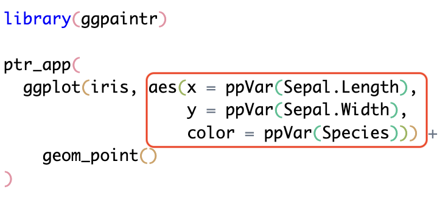
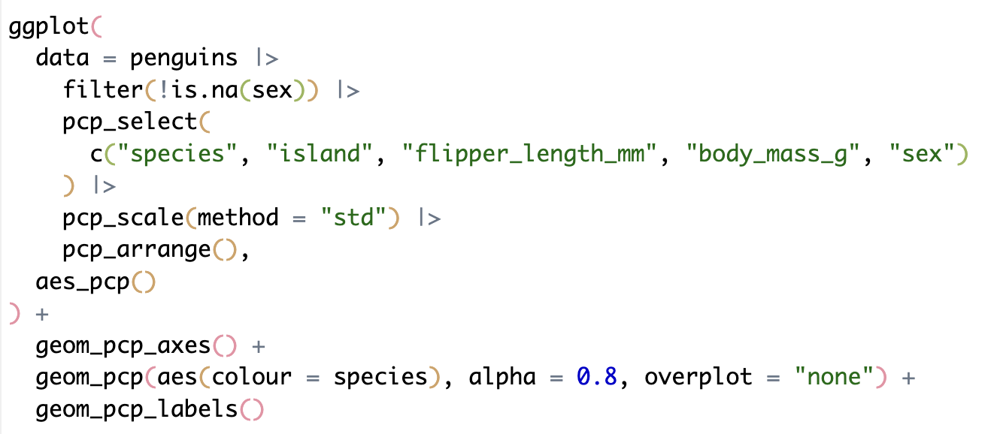

## The idea in one line {.smaller}

Write the plot you already know how to write — mark the parts a user should
control — and get a running Shiny app **for free**.

:::: {.columns}
::: {.column width="46%"}
```r
library(ggpaintr)

ptr_app(
  ggplot(iris,
    aes(x = ppVar(Sepal.Length),
        y = ppVar(Sepal.Width),
        color = ppVar(Species))) +
    geom_point()
)
```
:::
::: {.column width="54%"}
{height="330"}
:::
::::

. . .

No `ui`. No `server`. No widget IDs. No `.data[[input$x]]`.
One formula → a dashboard **and** the runnable code that reproduces it.

## Outline

- **Motivation** — when is a Shiny app worth it, and what does it cost to build one?
- **Demo** — the penguins dashboard, live
- **Background** — Shiny, the grammar of graphics, lazy & tidy evaluation
- **Design** — placeholders, embellishment, **interactive masking**
- **Extensibility** — custom placeholders, embedding, sharing, your own render path
- **Reproducibility** — the code panel and saved states
- **Related tools**, **limitations & future work**, and more examples

## &nbsp; {.isu-section background-image="assets/campus.jpg" background-size="cover"}

[Part 1]{.eyebrow}

[Motivation]{.big}

[]{.rule}

[When is a Shiny app worth building — and what does it cost?]{.sub}

## Two moments where a Shiny app pays off

:::: {.columns}
::: {.column width="50%"}
**Present your results**

You have a *finished* analysis. You want collaborators to **interact** with the
figure — swap a variable, re-color, filter — without sending them R code.

→ a **dashboard**
:::
::: {.column width="50%"}
**Explore your data**

You are *still looking*. You want to scan many versions of a plot quickly —
every pair of variables, different groupings.

→ an **exploration tool**
:::
::::

. . .

Both are the same move: **a graphic, with some components turned into controls.**

## Scenario 1 · Present results {.smaller}

A published parallel-coordinate plot of the penguins
[@vanderplas2023penguins], built with `ggplot2` + `ggpcp`. Turn it into a
dashboard: pick the axes, rescale, recolor.

{height="360"}

## &nbsp; {.isu-section background-image="assets/campus.jpg" background-size="cover"}

[Demo]{.eyebrow}

[Scenario 1]{.big}

[]{.rule}

[A published plot, made interactive]{.sub}

`shiny::runApp("demos/01-ggpcp-dashboard.R")`

::: {.notes}
App pre-launched in a browser tab — switch tabs, never cold-start. ~3 min.
If asked about the Draw button or code panel now: "I'll come back to that panel."
:::

## Scenario 2 · Explore data {.smaller}

The question: how does each pair of `iris` variables relate, split by a third?
In plain `ggplot2` you write one call, then edit it, again and again:

```r
library(ggplot2)

ggplot(iris, aes(x = Sepal.Length, y = Sepal.Width, color = Species)) +
  geom_point()

# now change x... and y... and color
ggplot(iris, aes(x = Petal.Length, y = Petal.Width, color = Species)) + geom_point()
ggplot(iris, aes(x = Sepal.Length, y = Petal.Length, color = Species)) + geom_point()
```

Re-typing the same call to change three slots is exactly the loop a widget
should absorb.

## &nbsp; {.isu-section background-image="assets/campus.jpg" background-size="cover"}

[Demo]{.eyebrow}

[Scenario 2]{.big}

[]{.rule}

[Three dropdowns: X, Y, Color]{.sub}

`shiny::runApp("demos/02-iris-explore.R")`

::: {.notes}
Pre-launched tab. Keep to ~1 min: swap x/y/color, Draw, done.
:::

## What that Shiny app costs by hand {.smaller .scrollable}

:::: {.columns}
::: {.column width="55%"}
```r
ui <- fluidPage(
  titlePanel("Iris scatter"),
  sidebarLayout(
    sidebarPanel(
      selectInput("x", "X variable",
        choices = names(iris)[1:4], selected = "Sepal.Length"),
      selectInput("y", "Y variable",
        choices = names(iris)[1:4], selected = "Sepal.Width"),
      selectInput("color", "Color variable",
        choices = names(iris), selected = "Species")
    ),
    mainPanel(plotOutput("plot"))
  )
)

server <- function(input, output, session) {
  output$plot <- renderPlot({
    ggplot(iris, aes(x = .data[[input$x]],
                     y = .data[[input$y]],
                     color = .data[[input$color]])) +
      geom_point()
  })
}
shinyApp(ui, server)
```
:::
::: {.column width="45%"}
The obligations behind those 28 lines:

- every widget needs a **unique ID, label, choices, default**
- the dropdown returns a **string**, but `aes()` wants a **symbol** → bridge with `.data[[input$x]]`
- the plot is declared **twice**: `plotOutput()` *and* `renderPlot()`, IDs must match
- UI pieces nest in the right order
- **each new control multiplies all of this**

Add a title, draw button, facet, smoothing method → 28 → 40 → 56 lines.
:::
::::

## The ggpaintr code {.smaller}

The same app — one `ptr_app()` call:

```r
ptr_app(
  ggplot(iris, aes(x = ppVar(Sepal.Length),
                   y = ppVar(Sepal.Width),
                   color = ppVar(Species))) +
    geom_point()
)
```

:::: {.columns}
::: {.column width="50%"}
{height="250"}
:::
::: {.column width="50%"}
{height="250"}
:::
::::

Each placeholder occurrence → exactly one control widget.

## Why this works — one idea {.smaller}

**Interactive masking.** The formula is captured *before it runs*. Instead of
filling in its blanks from fixed values, ggpaintr fills them from the **live
app** — the current widgets, the uploaded data, the toggled layers — on every
**Draw**.

. . .

Everything else is a consequence:

- **No UI↔server wiring.** One node is *both* the widget and the slot its value
  returns to, so they cannot drift out of step. A whole class of bug disappears.
- **The formula is the whole record.** Same formula → same app, every time.
- **Embellishment is free.** Placeholders are identity functions in plain R, so
  the embellished formula still draws the original plot on its own.
- **Reproducible output.** A side code panel prints runnable `ggplot2` code for
  exactly what is on screen.
- **Scales by writing formulas, not apps.** One formula = one visualization module.

::: {.notes}
Plain-language statement of the contribution. Part 3 restates it precisely
once data masking has been taught.
:::

## &nbsp; {.isu-section background-image="assets/campus.jpg" background-size="cover"}

[Demo]{.eyebrow}

[Penguins data]{.big}

[]{.rule}

[ppVar · ppNum · ppText · layer toggles]{.sub}

`shiny::runApp("demos/03-penguins-demo.R")`

::: {.notes}
Pre-launched tab. The workhorse demo (~4 min) — it illustrates the interactive-
masking idea just stated: widgets fill the formula's blanks on each Draw.
:::

## &nbsp; {.isu-section background-image="assets/campus.jpg" background-size="cover"}

[Part 2]{.eyebrow}

[Background]{.big}

[]{.rule}

[Shiny, the grammar of graphics, lazy & tidy evaluation]{.sub}

## Shiny apps

A **Shiny** app is an interactive web app written in R [@shiny].

- The developer writes a **UI** (input widgets + output panels) and **server
  logic** connecting them.
- Shiny binds each input to a **reactive value** and re-runs the relevant server
  code whenever an input changes — no page reload.
- Sliders, dropdowns, uploads drive R-computed plots, tables, and text.
- Widely used to **share an analysis** with people who don't write R.

`ggplot2` usually sits at the center: the grammar's components map onto widgets.

## ggplot2 and the grammar of graphics {.smaller}

The **grammar of graphics** [@Wilkinson2005] describes a plot as a *composition*
of small parts, not a chart type. `ggplot2` [@Wickham2016] implements it in
layered form [@Wickham2010]:

```r
ggplot(data, aes(x = ..., y = ..., color = ...)) +   # data + aesthetic mappings
  geom_point() +                                      # geometric layers
  facet_wrap(~ group)                                 # facets, scales, coords...
```

- A graphic = **data** + **aesthetic mappings** + **geometric layers** (+ scales, coords, facets).
- Layers combine with `+`. **Swap one part without rebuilding the rest** — exactly
  the move exploration needs.
- That structure is what ggpaintr hooks into: each controllable component becomes
  a widget.

## Lazy evaluation — R doesn't run code right away {.smaller}

R uses **lazy evaluation**: a function argument is evaluated only when needed.
This powers R's **metaprogramming** — capturing code *as code* before it runs.

```r
f <- function(x) substitute(x)   # capture the argument's expression
f(a + b * 2)
#> a + b * 2                      # the CODE, not a value
```

- `f()` never receives the *value* of `a + b * 2` — it receives the **code
  itself**, which can be inspected, taken apart, and rewritten before it runs.
- **ggpaintr captures the formula this way** and then *manipulates the
  expression* — splitting layers, recording placeholder positions, substituting
  values — before it is ever evaluated.

::: aside
Reference — base tools: `substitute()`, `match.call()` (capture); `quote()`, `bquote()` (quote / partial substitute); `eval()` + `with()` (evaluate against data).
:::

## Tidy evaluation — rlang and data masking {.smaller}

**Tidy evaluation** [@HenryWickham2017; @rlang] consolidates R's base tools
behind one clean interface, and adds **data masking**:

```r
aes(x = Sepal.Length)     # `Sepal.Length` is NOT looked up now...
                          # ...later it resolves against a data frame: data masking
```

- There is no variable `Sepal.Length` in the workspace — yet this works. The
  name waits, then resolves **inside the data frame**: that is **data masking**.
- The result: column names resolve **as variables** while other names resolve at
  the call site.

::: aside
Reference — the rlang interface: a **quosure** bundles a captured expression with its environment; `enquo()` / `{{ }}` defuse, `!!` unquotes, `eval_tidy()` evaluates with the `.data` / `.env` pronouns.
:::

. . .

**ggpaintr's twist:** keep this loop, but change *what the expression resolves against.*

## &nbsp; {.isu-section background-image="assets/campus.jpg" background-size="cover"}

[Part 3]{.eyebrow}

[Design]{.big}

[]{.rule}

[Placeholders, embellishment, and interactive masking]{.sub}

## Placeholders {.smaller}

A **placeholder** occupies one value inside an ordinary `ggplot2` expression.
Its name says which widget to build and how to substitute the widget's value.

| Placeholder | Widget | Substitutes to | Role |
|---|---|---|---|
| `ppText` | text input | a character literal | value |
| `ppNum` | numeric input | a numeric literal | value |
| `ppExpr` | text-area | an R expression (denylist-checked) | value |
| `ppVar` | column picker | the chosen column (a symbol) | **data consumer** |
| `ppUpload` | file upload | a data frame (.csv/.rds/.xlsx/...) | **data source** |

- With an argument — `ppVar(Sepal.Length)` — the argument is the widget's **default**.
- Written bare — `ppVar` — the slot starts **blank**.
- Plus two **structural keywords**: `ppLayerOff()` (start a layer off) and
  `ppVerbSwitch()` (toggle a pipeline stage).

## Consumers see their upstream data {.smaller}

A `ppVar` picker offers the columns of the data frame **that flows into its
layer** — the parser threads that context down the tree.

```r
ptr_app(
  iris |>
    group_by(ppVar) |>            # pickers here see RAW iris columns
    summarise(mean_val = mean(ppVar)) |>
    ggplot(aes(x = ppVar, y = ppVar)) +   # pickers here see the REDUCED frame
    geom_col()
)
```

A reshaping step changes the columns: a picker **upstream** of it sees different
choices than one **downstream**. The list refreshes at run time when an upload
replaces the data.

## Embellishment {.smaller}

Wrapping an object in a placeholder is **embellishing** it. The embellishment
functions are the **identity in plain R**:

```r
ppVar <- function(x = NULL, ...) x      # (conceptually)
```

- So a placeholder-embellished formula is **still ordinary `ggplot2` code** — on
  its own it draws the original plot.
- An analyst embellishes their working plot **at no cost**, keeping the option to
  turn it into an app whenever they want.
- The default values let ggpaintr **open the app on the finished plot**, not a blank one.
- At draw time ggpaintr substitutes each placeholder with its widget's value and
  evaluates — the *same* substitution on the plain code is the reproducible output.

## Interactive masking — the precise statement {.smaller}

Tidy evaluation defers **which data** a fixed expression binds.
ggpaintr additionally defers **which expression runs at all.**

- Tidy eval resolves the captured code against **a data frame, handed over once**.
- ggpaintr resolves it against the **live, changing state of a running Shiny
  session** — current controls, uploaded data, which layers/stages are on —
  *reassembled on each draw.*
- The mask is **written into the formula itself**: a placeholder both declares
  the widget *and* names the slot it fills.
- **Doubled laziness** = *which data* **+** *which expression*. That is what
  "lazy-lazy" names.

## One formula, one parse, three views {.smaller}

{height="380"}

The widget panel, the figure, and the code panel are **three views of the same
filled-in tree** — they agree *by construction.*

## Why a Draw button, not live reactivity?

- ggpaintr re-renders on an explicit **Draw / Update** click, not on every keystroke.
- A user typing a label, or coordinating two controls in sequence, would
  otherwise push the plot through **intermediate states they never meant to show.**
- And someone copying the code mid-keystroke would leave with code for a state
  they never kept.
- One click = one **snapshot**: plot, substituted formula, and code panel all
  refer to the *same* state.
- On a bad input the runtime **catches the error**, reports where it failed, and
  leaves the parsed formula intact — the session doesn't crash.

## &nbsp; {.isu-section background-image="assets/campus.jpg" background-size="cover"}

[Part 4]{.eyebrow}

[Extensibility]{.big}

[]{.rule}

[Custom placeholders, embedding, sharing, your own render path]{.sub}

## The vocabulary is open {.smaller}

Register a new placeholder in one of the **three roles** — it then behaves
exactly like a built-in:

| Role | Hook to define it | Resolver | Gets the data? |
|---|---|---|---|
| value | `ptr_define_placeholder_value()` | `resolve_expr` | no |
| data consumer | `ptr_define_placeholder_consumer()` | `resolve_expr` | upstream `cols` + `data` |
| data source | `ptr_define_placeholder_source()` | `resolve_data` | produces the frame |

- Two hooks: a **`build_ui`** returning the Shiny tag, and a **resolver** turning
  the widget value into the right object.
- A `parse_positional_arg` validator (from the `ptr_arg_*` family) opts in to a
  default like `ppScaleMethod("uniminmax")`.
- Registration is **session-wide** — define once, visible to every app/module.

## Custom placeholder — example {.smaller .scrollable}

Two placeholders the parallel-coordinate dashboard needs — each is just **two
hooks**: a widget builder (`build_ui`) and a resolver (`resolve_expr`):

```{.r code-line-numbers="4,7,15,17"}
# CONSUMER: pick several columns at once
ppVars <- ptr_define_placeholder_consumer(
  keyword = "ppVars",
  build_ui = function(node, cols, data, label = NULL, selected = NULL, ...)
    selectInput(node$id, label %||% "Columns", choices = cols,
                selected = intersect(selected %||% character(), cols), multiple = TRUE),
  resolve_expr = function(value, node, ...)
    if (length(value)) rlang::call2("c", !!!as.list(value)) else NULL,
  parse_positional_arg = ptr_arg_string(vector = TRUE)
)

# VALUE: choose a scaling method
ppScaleMethod <- ptr_define_placeholder_value(
  keyword = "ppScaleMethod",
  build_ui = function(node, label = NULL, selected = NULL, ...)
    selectInput(node$id, label %||% "Scaling", choices = c("raw","std","uniminmax")),
  resolve_expr = function(value, node, ...) if (nzchar(value)) as.character(value) else NULL,
  parse_positional_arg = ptr_arg_string()
)
```

Full versions: `demos/06-custom-placeholder.R` (minimal) and
`demos/01-ggpcp-dashboard.R` (these two).

## Embed in a calling app — `ptr_ui()` / `ptr_server()` {.smaller .scrollable}

`ptr_app()` is the turn-key entry. Drop one level to place a ggpaintr plot inside
**your own** app — you own the `shinyApp()` shell:

```{.r code-line-numbers="7,11"}
f <- rlang::expr(
  ggplot(mtcars, aes(ppVar(mpg), ppVar(wt), color = ppVar(cyl))) + geom_point()
)

ui <- fluidPage(
  h2("My dashboard"),
  ptr_ui(!!f, "plot1")          # controls + output go here
)

server <- function(input, output, session) {
  ptr_server(!!f, "plot1")      # matching id; call it BARE, not in moduleServer()
}
shinyApp(ui, server)
```

Three tiers: `ptr_app()` → `ptr_ui()` + `ptr_server()` → the bare
`ptr_ui_controls()` / `ptr_ui_plot()` / `ptr_ui_code()` pieces for a custom layout.

## Multi-instance + shared placeholders {.smaller .scrollable}

Several panels in one session; **one control drives all of them** via a `shared` key.

```{.r code-line-numbers="3,5,8,11,16"}
plots <- list(
  expr(ggplot(penguins, aes(flipper_length_mm, body_mass_g,
                            color = ppVar(species, shared = "grp"))) + geom_point()),
  expr(ggplot(penguins, aes(bill_length_mm, bill_depth_mm,
                            color = ppVar(species, shared = "grp"))) + geom_point())
)

obj <- ptr_shared(plots)                        # 1. build the coordinator

ui <- fluidPage(
  ptr_shared_panel(obj),                        # 2. place the ONE shared widget
  fluidRow(column(6, ptr_ui(plots[[1]], "body", shared = obj)),
           column(6, ptr_ui(plots[[2]], "bill", shared = obj)))   # 3. shared = obj
)
server <- function(input, output, session) {
  sh <- ptr_shared_server(obj)                  # 4. drive it; thread shared_state
  ptr_server(plots[[1]], "body", shared_state = sh)
  ptr_server(plots[[2]], "bill", shared_state = sh)
}
```

Same `"grp"` key in both formulas → one top-level picker recolors both panels.

## Own the render path — plotly {.smaller .scrollable}

A calling app can render the plot **itself**, reading the runtime state
`ptr_server()` returns. This is also where in-plot interactivity (hover, zoom) lives.

```{.r code-line-numbers="6,8,10"}
ui <- fluidPage(
  ptr_ui_controls(plots[[2]], "bill", shared = obj),   # sidebar only...
  plotly::plotlyOutput(NS("bill")("scatter"))          # ...our own output
)
server <- function(input, output, session) {
  state <- ptr_server(plots[[2]], "bill", shared_state = sh)
  output[[NS("bill")("scatter")]] <- plotly::renderPlotly({
    res <- state$runtime()                 # $ok / $plot / $code
    req(isTRUE(res$ok), res$plot)
    plotly::ggplotly(res$plot)             # add interactivity ourselves
  })
}
```

## &nbsp; {.isu-section background-image="assets/campus.jpg" background-size="cover"}

[Demo]{.eyebrow}

[Embedding]{.big}

[]{.rule}

[Two modules, shared picker, plotly render]{.sub}

`shiny::runApp("demos/05-multimodule-plotly.R")`

::: {.notes}
Pre-launched tab. Show: one shared picker recolors both panels; hover/zoom on
the plotly panel = calling app owns that render path.
:::

## &nbsp; {.isu-section background-image="assets/campus.jpg" background-size="cover"}

[Part 5]{.eyebrow}

[Reproducibility]{.big}

[]{.rule}

[The code panel, and saved states with spec]{.sub}

## The code panel {.smaller}

Every draw, ggpaintr prints **runnable `ggplot2` code for the displayed plot** —
every placeholder replaced by the concrete value it stood for.

:::: {.columns}
::: {.column width="50%"}
{height="300"}
:::
::: {.column width="50%"}
{height="300"}
:::
::::

Paste it into a clean R session → the **same plot**.

## Reload a previous state with `spec` {.smaller}

The code panel can switch from final code to a **spec view** — a list of the
current widget values:

```r
ptr_spec <- list(
  ggplot_1_1_ppVar_NA = "carb",
  geom_point_checkbox = FALSE,
  geom_point_2_1_2_ppNum_NA = 5
)
```

- Pass that block back as the `spec` argument:
  `ptr_app(formula, spec = ptr_spec)` — it **seeds every widget at startup**.
- The app **reopens in that exact state** — like how embellishment seeds widgets
  from the literal defaults in the formula.
- Each spec is independent → save **several finished states** and reopen any of them.

## &nbsp; {.isu-section background-image="assets/campus.jpg" background-size="cover"}

[Part 6]{.eyebrow}

[Related tools & more]{.big}

[]{.rule}

[Where ggpaintr sits, and where to go next]{.sub}

## Compared with other tools {.smaller}

Most tools serve a user **constructing** a chart through a GUI. ggpaintr
addresses an earlier step: how the **developer publishes** the formula-derived app.

| Tool | Authoring interface | Reproducible artifact | Embeddable? |
|---|---|---|---|
| **ggpaintr** | a `ggplot2` formula with placeholders | formula **+** code panel | **yes** |
| esquisse | drag-and-drop gadget | plot snippet | yes |
| ggplotgui | menu-driven app | plot snippet | no |
| ggThemeAssist | addin for `theme()` | edited `theme()` call | no |
| ggannotate | click-to-place gadget | annotation call | no |
| RAWGraphs | browser D3 GUI | an image (no R code) | no |

. . .

**vs. esquisse** (closest neighbor): esquisse offers a chart-authoring menu;
ggpaintr lets the developer **pre-write a specific plot** — a third-party geom,
`coord_polar()`, a multi-layer composition — and expose only chosen slots.

## More examples to try {.smaller}

- `demos/01-ggpcp-dashboard.R` — parallel coordinates + two custom placeholders
- `demos/02-iris-explore.R` — the 4-line exploration app
- `demos/03-penguins-demo.R` — the full value/consumer showcase
- `demos/04-iris-handwritten-shiny.R` — the same app, written by hand (the cost)
- `demos/05-multimodule-plotly.R` — embed + shared + own plotly render
- `demos/06-custom-placeholder.R` — the smallest custom placeholder

ggpaintr composes with `ggplot2` **extension packages**, data **pipelines**,
**uploads**, and your **own render path** — not a fixed chart catalogue.

## Limitations & future work {.smaller}

**Limitations**

- Reproducibility stops at what the artifacts record: the app reproduces given
  the **same ggpaintr version** and any **custom-placeholder registrations**
  (those live outside the formula text); the code panel does **not** capture
  the uploaded data frame, package versions, or transformations the calling
  app applies *after* ggpaintr hands the object back.
- The **denylist** on `ppExpr` is a safety check for the trusted developer/user
  workflow — **not** a security boundary. A deployment taking formulas from
  outside parties must add its own trust boundary.

. . .

**Future work**

- **Language models.** `ptr_llm_primer()` / `ptr_llm_topic()` /
  `ptr_llm_register()` brief a model (via `ellmer`) so it answers with a
  **formula**, not a whole app — one short line to read instead of `ui`/`server`
  scaffolding to audit. Shipped, but whether it measurably improves assistant
  reliability is an **open empirical question**.
- A CRAN release, and a community collection of registered placeholders
  (date pickers, color pickers, multi-handle sliders).

## Takeaways

- One `ggplot2`-style **formula** → a running Shiny app **+** reproducible code,
  with no UI↔server wiring.
- **Placeholders** turn slots into widgets; **embellishment** keeps the formula
  valid plain R.
- The engine is **interactive masking**: defer which data *and* which
  expression runs, resolved against the live session on each draw.
- **Extensible** (custom placeholders, embedding, sharing, own render) and
  **reproducible** (code panel + `spec`).

## Thank you {.contact}

:::: {.columns}
::: {.column width="50%"}
[Wangqian Ju]{.name}

[Department of Statistics]{.title}

Iowa State University

github.com/willju-wangqian/ggpaintr
:::
::: {.column width="50%"}
[Documentation]{.name}

[Package website]{.title}

willju-wangqian.github.io/ggpaintr
:::
::::

## References {.smaller}

::: {#refs}
:::

## Backup · The rlang machinery inside ggpaintr {.smaller visibility="uncounted"}

- **Capture.** The unquoted formula enters through `rlang::enexpr()`; the plain
  string fallback is parsed to the same expression.
- **The placeholder node is the structural counterpart of a quosure.** A quosure
  bundles a captured expression with the *environment* its names resolve in; a
  placeholder node instead carries a **widget id**, a **role** (value /
  consumer / source), a **default**, and a **validator** — the payload that lets
  one node stand for both a widget and the slot it feeds.
- **Substitution.** On each Draw, widget values are dropped back into the stored
  tree (`rlang::call2()`, `!!`) and the substituted expression is evaluated.
- **Masking is per-node.** Each consumer (`ppVar`) resolves against its *own
  upstream data mask*, so several local masks can be live in one formula —
  e.g. upstream vs downstream of a `summarise()`.

## Backup · `ppExpr` and the denylist {.smaller visibility="uncounted"}

- `ppExpr` is the only placeholder that accepts an **arbitrary R expression**:
  the app user types it, and the *host's* R session evaluates it.
- At **parse time** ggpaintr walks the expression tree against a built-in
  **denylist** of high-risk operations and aborts before the runtime ever sees
  a dangerous call.
- Developer controls: **disable** the check, **override** the built-in list, or
  supply an **allowlist** — for trusted formulas only.
- Scope of the claim: a *safety check* for the developer-and-user workflow,
  **not a security boundary** — known-dangerous calls are blocked, but
  untrusted input can evade it; an outside-facing deployment needs its own
  trust boundary.
